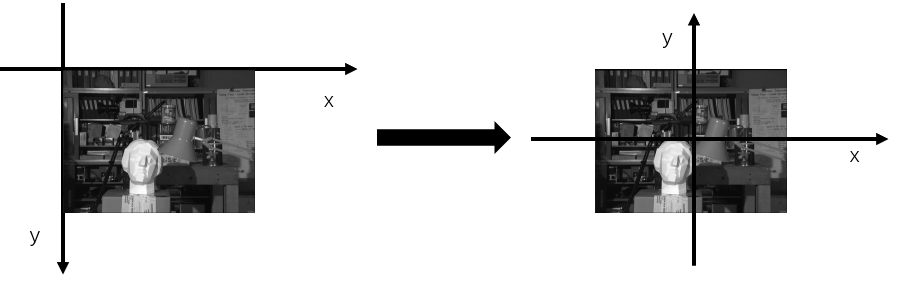
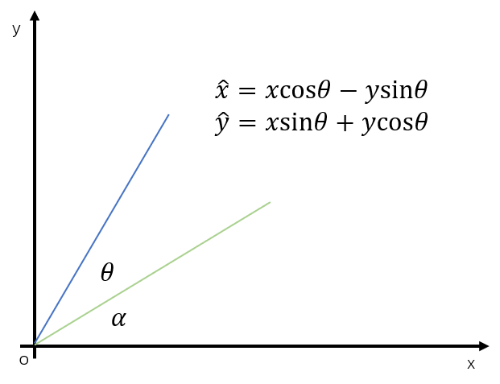

# Interpolation & rotation transformation
## Interpolation
Our goal is to find a transformation matrix $M$, which makes:
```math
P_d\odot M=\hat{P_d},
```
where $P_d$ denotes coordinate of the image in *digital coordinate system*. 
```math
P_d = [x_d, y_d, 1]
```
---
The *image coordinate system (ICS)* is different from the *digital coordinate system (DCS)*. We use two matrices that are the inverse of each other to convert the image from ICS to DCS.


---
So we have:
```math
\hat{P_i}=P_i\odot 
\begin{bmatrix}
{1}&{0}&{0}\\
{0}&{-1}&{0}\\
{-\frac{W_0}{2}}&{\frac{H_0}{2}}&{1}\\
\end{bmatrix} \odot
\begin{bmatrix}
{\frac{\hat{W}}{W_0}}&{0}&{0}\\
{0}&{\frac{\hat{H}}{H_0}}&{0}\\
{0}&{0}&{1}
\end{bmatrix} \odot
\begin{bmatrix}
{1}&{0}&{0}\\
{0}&{-1}&{0}\\
{\frac{\hat{W}}{2}}&{\frac{\hat{H}}{2}}&{1}
\end{bmatrix},
```
where $\hat{P_i}$ and $P_i$ represents the interpolated image and original image respectively.

---
In actual calculation, we first have the coordinate in $\hat{P_i}$ and use the above formant to calculate its corresponding point in $P_i$. Then we use the bilinear interpolation algorithm to calculate its color value.

Our goal is to get the color of purple point. Firstly we calculate the color of two green points along the x-axis. Then the color of purple point can be calculated by two green points along the y-axis.

## Rotation

Be same as the interpolation, we calculate the transformation matrix:
```math
\hat{P_i}=P_i\odot 
\begin{bmatrix}
{1}&{0}&{0}\\
{0}&{-1}&{0}\\
{-\frac{W_0}{2}}&{\frac{H_0}{2}}&{1}\\
\end{bmatrix} \odot
\begin{bmatrix}
{\cos{\theta}}&{\sin{\theta}}&{0}\\
{-\sin{\theta}}&{\cos{\theta}}&{0}\\
{0}&{0}&{1}
\end{bmatrix} \odot
\begin{bmatrix}
{1}&{0}&{0}\\
{0}&{-1}&{0}\\
{\frac{\hat{W}}{2}}&{\frac{\hat{H}}{2}}&{1}
\end{bmatrix}.
```

# Affine transformation
Observation two images, it can be easily found that a shear transformation are used. And the size of original image and processed image are known. So we have the transformation matrix:
```math
\begin{array}{cl}
& \hat{P_i}=P_i\odot 
\begin{bmatrix}
{1}&{0}&{0}\\
{0}&{-1}&{0}\\
{-\frac{W_0}{2}}&{\frac{H_0}{2}}&{1}\\
\end{bmatrix} \odot
\begin{bmatrix}
{1}&{b}&{0}\\
{a}&{1}&{0}\\
{0}&{0}&{1}
\end{bmatrix} \odot
\begin{bmatrix}
{1}&{0}&{0}\\
{0}&{-1}&{0}\\
{\frac{\hat{W}}{2}}&{\frac{\hat{H}}{2}}&{1}
\end{bmatrix}\\
{\text { subject to }}\\
& \begin{cases}
250-250a=275\\
250+250b=325\\
\end{cases} →
\begin{cases}
a = -0.1\\
b = -0.3\\
\end{cases}
\end{array}.
```
After calculation:
```math
M_{a\_ori2a\_trans}=
\begin{bmatrix}
{1}&{0.3}&{0}\\
{0.1}&{1}&{0}\\
{0}&{0}&{1}
\end{bmatrix}\\
M_{a\_trans2a\_ori}=
\begin{bmatrix}
{1.0309}&{-0.3093}&{0}\\
{-0.1031}&{1.0309}&{0}\\
{0}&{0}&{1}
\end{bmatrix}\\

```
# How can I can your code?
- Including package `matplotlib`, `numpy` and `opencv-python`
- `python interpolation.py`
- `python rotation.py`
- `python affine.py -tt o2t` or `python affine.py -tt t2o`


# Questions
1. affine变换在2-d平面上不是线性变换，但可由3-d矩阵表示，是否意味着affine变换在更高维度上是线性变换？
2. 如果处理图形插值过程中边缘/越界的问题？